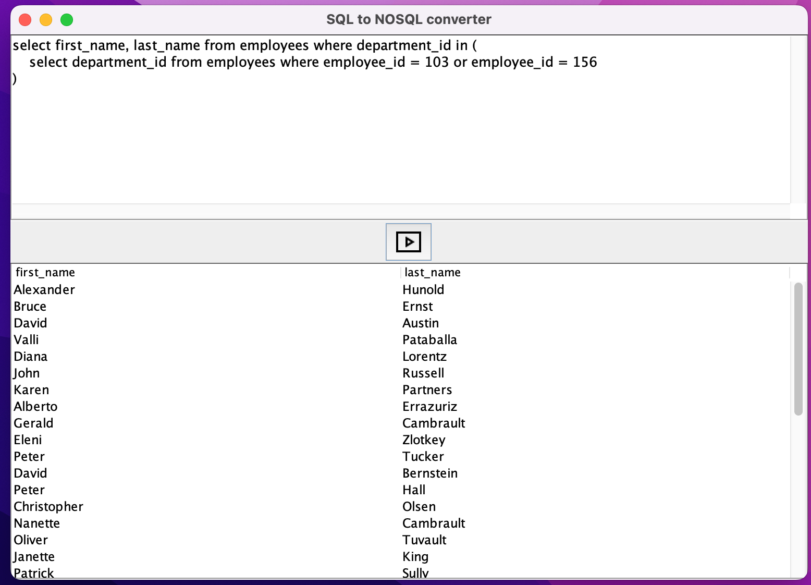

[](https://classroom.github.com/a/6hx3LrEQ)

## SQL to Mongo parser

This project is a part of the "Databases' university subject. This is a simple app \
where the user can query the Mongo database using SQL. Our task was to give an object \
representation of an SQL query, validate it and parse it to a Mongo query. Then we \
query the Mongo database and show the results.

### Our pipeline

The pipeline can be seen in the app/AppCore file. It consists of: 
1. Representing the query as an SQL object (sql package) 
2. Validating the query (validator package) 
3. Adapting the query for Mongo (adapter package) 
4. Querying the Mongo DB (database package)



### Certain limitations of the project

If we wish to show a column that is not from a table we're querying, the table name needs \
to be given as well. Example:
```
select last_name, departments.department_name, locations.street_address 
from hr.employees join departments using (department_id) join locations using (location_id)
where last_name like 'P%'
```

Our code accepts an sql select statement: 

| clause   | parameters                                                       |
|----------|------------------------------------------------------------------|
| SELECT   | multiple parameters with aggregate functions, no aliases         |
 | FROM     | up to 2 joins                                                    |
 | WHERE    | either multiple inequalities or 1 simple subquery ('=' and 'in') |
 | HAVING   | not supported                                                    |
| GROUP BY | multiple parameters                                              |
| ORDER BY | multiple parameters asc and desc                                 |

 **The query cannot at the same time have a join and a subquery.** \
 It complicates the mongo query (introduces a $pipeline to our $aggregate pipeline). 

Subqueries are simple, like: \
SELECT A FROM B WHERE C = 10

